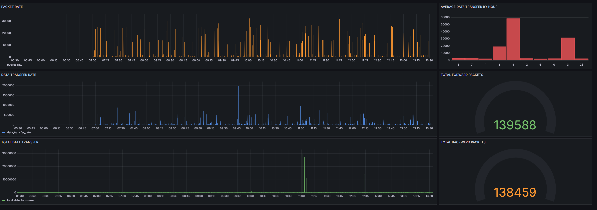
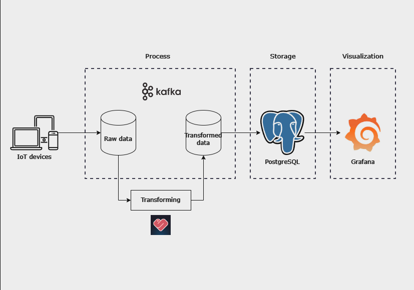

# IoT Network Flows Dashboard


## About the project:

Modern IoT environments generate massive amounts of network traffic data. Analyzing this data in real-time is crucial for understanding network behavior, identifying potential security threats, and optimizing network performance.

This project simulates a real-time IoT network monitoring scenario where network flow data is continuously generated by various devices.

The dashboard provides insights into network traffic patterns, helping network administrators or security analysts to detect anomalies, troubleshoot issues, and make informed decisions about network management.

## Project Objectives:


- Ingest real-time network flow data from a Kafka topic (simulated using a Python producer).

- Clean, transform, and enrich the data using Python with Quixstreams library.

- Load the transformed data into a PostgreSQL database.

- Build an interactive dashboard using Grafana to visualize key metrics and insights from the data.

## Folders map:
```
IoT-network-app
|
| _ docker-compose.yml
|   
+---data
|       data.csv
|       
+---psql
|       create_table.sql
|       
+---scripts
|   +---loader
|   |       loader.py
|   |       requirements.txt
|   |       
|   +---producer
|   |       producer.py
|   |       requirements.txt
|   |       
|   \---transformer
|           requirements.txt
|           transformer.py
|       
\---sqldatabase
```
## Tools:

This project was built using these technologies:
- **Docker**: Built and manage components.
- **Python**: Main programing language
- **Kafka**: Streaming platform.
- **QuixStreams**: A python library for developing real-time streaming applications.
- **PostgreSQL**: Relational database to store data.
- **Grafana**: Visualization

## Further improvements:

### Performance:
In this pipeline, the GeoIP lookups is the bottleneck. This could be a huge problem when working with a large volume of data.

There are several solutions to consider:
- **Caching**: Store the GeoIP lookups results in a cache to avoid making repeated requests.
- **Batching**: Find a GeoIP provider that support batch requests to retrieve information for multiple IPs simultaneously.
- **Local GeoIP database**: If we have a relatively static set of IP addresses, a GeoIP database could help us eliminate the need of an external API. Suitable for a large dataset.
- **Increase number of transformer**: In this project, we can increase the number of transformer with docker. Each container or node will process a portion of the incoming Kafka messages independently (parallel processing).

### Data quality:
Since this is kafka-based data pipeline, we can leverage **Kafka Schema Registry** to ensure the quality of the data. The Schema Registry helps defining schemas for Kafka topics and enforcing that all messages produced to those topics adhere to the defined schema. This prevents incompatible or malformed data from entering the pipeline, ensuring data consistency and integrity.

### Scalability:
- **Adding Kafka brokers:** Improve the overall throughput of the kafka cluster, allowing it to handle more message per second. Also, improve fault tolerance as data is replicated across multiple brokers.
- **NoSQL database:** Using a NoSQL database instead of a relational database like PostgreSQL for storing data can increase the scalability for this pipeline as NoSQL support horizontal scaling. This solution should be considered if you anticipate massive data volumes or require more flexibility in your data model.

### Security:
For this project, we can leverage the SSL/TLS encryption of Kafka and PostgreSQL for communication between Kafka components and PostgreSQL database.

### Maintainability:
Embedding logging into the python code can enhance the maintainablility as a well-placed log message could provide crucial clues about what when wrong, where it happened and potentially why it occurred.

Another way to improve maintainability is adding unit tests for python functions and modules to ensure they work correctly. This helps catch errors in the early development process.
